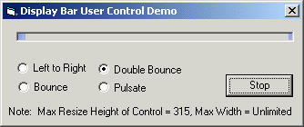



## animated wait bar User control

### Description

lightweight compile in display bar...

give users something to look at while they are waiting...4 animations to choose from..adds about 16k to your exe.

Dont forget to check my sight for more stuff:

http://geocities.com/dzzie
 
### More Info
 

             |
---                |---
**Submitted On**   |2001-08-07 07:14:52
**By**             |[dzzie](https://github.com/Planet-Source-Code/PSCIndex/blob/master/ByAuthor/dzzie.md)
**Level**          |Beginner
**User Rating**    |4.3 (47 globes from 11 users)
**Compatibility**  |VB 6\.0
**Category**       |[Custom Controls/ Forms/  Menus](https://github.com/Planet-Source-Code/PSCIndex/blob/master/ByCategory/custom-controls-forms-menus__1-4.md)
**World**          |[Visual Basic](https://github.com/Planet-Source-Code/PSCIndex/blob/master/ByWorld/visual-basic.md)
**Archive File**   |[animated w255198282001\.zip](https://github.com/Planet-Source-Code/dzzie-animated-wait-bar-user-control__1-26754/archive/master.zip)

